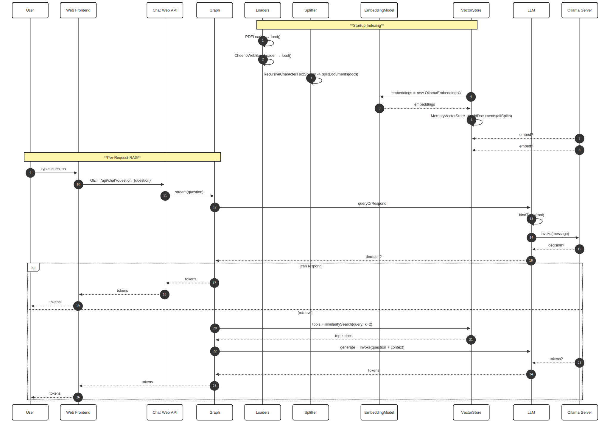
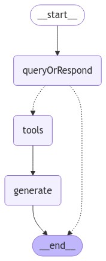

# Promtior RAG Chatbot challenge

## Overview

This repository contains a simple RAG (Retrieval-Augmented Generation) chatbot
that uses the PromtiorAI Website and a given PDF with more context about the
company as knowledge base, to generate responses based on user questions.

## Tech stack

- Deno & Fresh: Lightweight, zero-configuration web framework for server-side
  rendering (islands architecture) and API routes.

- LangChain.js: Orchestrates the RAG workflow execution including indexing,
  retrieval and generation. For that it provides document loaders, text
  splitting and vector storage.

- Ollama: Self-hosted Llama-family models for embeddings (OllamaEmbeddings) and
  chat (ChatOllama), running locally and exposed via ngrok.

- Docker: Containers Deno runtime to run the Fresh web server and all needed
  dependencies. E.g.: The Promtior pdf slides used as extra context.

- AWS Fargate: The solution is deployed using serverless containers on ECS that
  hit the local Ollama server via ngrok.

### Components diagram

The architecture was designed considering two things: simplicity and showcasing
knowledge. Where simplicity stands for cost effectiveness and time consuption.

The architecture is composed of a single container running a Deno web server
using the Fresh framework. The web server exposes a single endpoint that serves
the chatbot UI and a single API endpoint that handles the chat requests.

The model behind the indexing and retrieval steps is Ollama3.2. It was chosen
since it's free and supports all langchain.js features. It was decided to host
the Ollama server locally since otherwise it would have been too expensive to
run it as a sidecar container to the application. This means that to make the
server availble to the application in AWS, it was necessary to expose the local
server via ngrok. This is not a production ready solution but it works for the
purpose of this challenge.

Below is a diagram illustrating the architecture of the solution:

### Sequence diagram

When the container starts, it performs a one‑time indexing pass: loading the PDF
slides from within the container and scraping content from the Promtior website.
This text is then chunked and embedded (also using the Ollama server but this
time the embedding model instead), populating the in-memory vector store. At
query time, the browser sends an HTTP request with the question. The app then
goes throught the retrieval step using the chains appraoch to keep track of the
conversational history as part of the context, in addition to leveraging the
concept of tool-calling to finally be able to figure out whether it can answer
the question directly wihtout an addiotional retrieval step, or if it needs to
use the provided tool for retrieving the addiotional context and generating the
final answer. This flow prioritizes user experience with real‑time streaming of
tokens as the response arrives. The agentic approach that enabled multiple
retrieval steps works better but doesn't support streaming the answer by token,
but whole steps instead.

Below there's a sequence diagram illustrating the flow of the application
startup and following requests:

### Graph diagram

The whole purpose of this section is to better illustrate the decision three that the graph goes through when generating an answer to the user input. Under the hood, the chatbot’s logic is driven by a simple StateGraph: it first attempts to answer directly from the LLM call (queryOrRespond), and
only when additional information is needed does it invoke the retrieve tool to
fetch context. That context feeds into a final generation step (generate) where the LLM is also called, but this time including the retrieved context. Then the final answer from the LLM is streamed back the user.

Note that this approach generated at most just one retrieval step, but it could
be extended to allow for multiple retrieval steps if needed by using the agentic
approach to handle the conversation.

## Improvement opportunities

- Persistent Vector Store: Swap out in-memory storage for Postgres + PGVector to
  retain embeddings across restarts, scale, and provide a better experience
  adding more features like multiple chats and chat organization.

- S3 Ingestion: Let users submit arbitrary PDFs to S3 from where the application
  can read the file and update the vector store dynamically.

- Figure out a way to better read content from large websites.

- Prevent the chat-bot from giving away information about the context and almost
  always chaining previous responses together in the current one.

## Conclusion

Although the solution is able to answer questions about the company as stated in
the requirements, there are still too many improvements to be made in order to
make it practical for a real use case. It's very notorious that the current
solution has limitations to properly ingest the context and give "smarter"
answers. Tweaking the indexing process by increasing chunk overlap during
splitting, and customizing the template prompt did help but didn't yield
satisfactory results in my opinion as the chatbot gave away too much information
about the contextit, chained previous responses, among other issues. Two things
that improved the chatbot behavior a lot were:

- Using a different model for the chat completion, specifically Qwen3 instead of
  Llama3.2, but it didn't support tooling so I ended up not using it.

- Using an agent for managing chat history instead of a chain. However, this
  approach didn't support token streaming so I ended up not using it.
